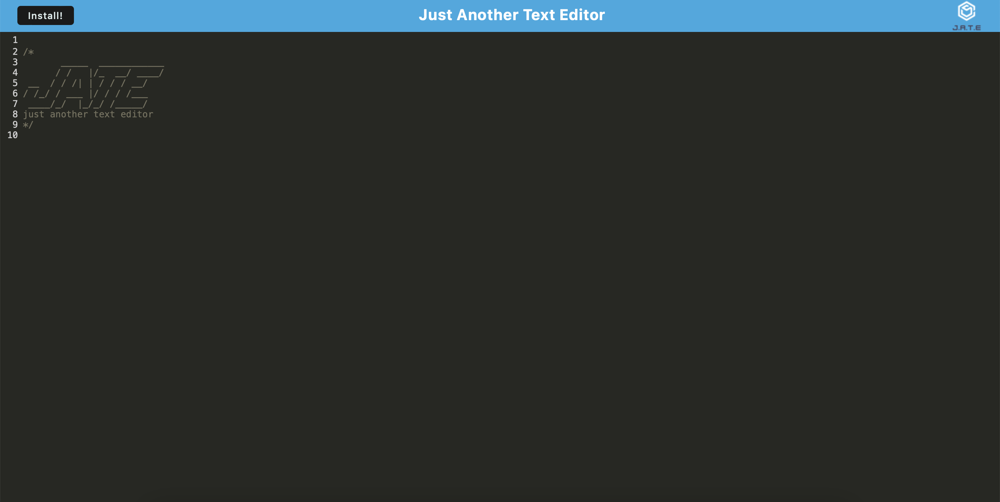

# hw19_textEditor

## Table of Contents 📚

- [Description](#description)
- [Preview](#preview)
- [Installation](#installation)
- [Usage](#usage)
- [Links](#links)

## Description 📋

Text editor app that runs in the browser & meets PWA criteria. Features data persistence techniques that serve as redundancy in case one of the options is not supported by the browser. App can function offline. 

## Preview 📸

## Installation 🔐

- clone repository
- npm i
- npm start

## Usage 🖥

Made for developers that would like to create notes or code snippets with or without an internet connection in order to reliably retrieve them for later use.

## Links 💾

**[GitHub Link ✨](https://github.com/mxhuisken/hw19_textEditor)**

**[Deployed Link ✨](https://texteditior-hw.herokuapp.com)**
